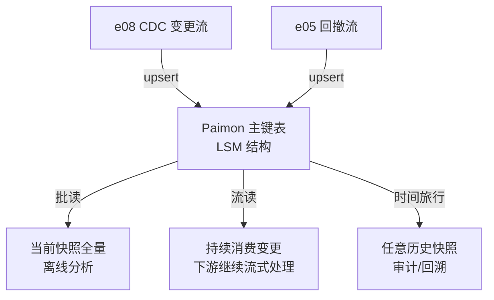

# e09 · 湖仓一体(Paimon / Iceberg,5 个 SQL 脚本)

> 对应教材:[docs/09-lakehouse](../../docs/09-lakehouse/README.md) · Level:L5
> 无 Java 模块(纯 SQL,不进 Maven `<modules>`)。前置:`bash scripts/fetch_lakehouse_jars.sh` 下载 jar 到 `docker/jobs/`,再用 SQL Client 逐个执行本目录脚本。

## 1. 背景

湖仓表格式(Paimon/Iceberg/Hudi)解决的核心问题:让对象存储上的文件集合拥有"表"的 ACID 语义、可流式更新、可时间旅行——这是 e05 SQL 世界(changelog/回撤)与 e07/e08(落地/CDC)最终的存储归宿。

## 2. 脚本矩阵

| 脚本 | 主题 | 关键观察 |
|---|---|---|
| 00-setup.sql | ADD JAR + Paimon Catalog | Catalog 指向 s3://warehouse/paimon(MinIO) |
| 01-primary-key-table.sql | 主键表 upsert | 重复写入同 order_id,批读仍只有一行(LSM merge) |
| 02-changelog-and-streaming-read.sql | changelog-producer + 流读 | 同一张表可批读(全量快照)也可流读(持续消费变更) |
| 03-compaction-and-time-travel.sql | compaction + 时间旅行 | `orders_pk$snapshots` 系统表;按快照ID/时间戳查历史 |
| 04-iceberg-catalog.sql | Iceberg 对照 | 同数据的另一种湖仓表达;FOR SYSTEM_TIME AS OF 语法 |
| 05-paimon-vs-iceberg.sql | 选型对比 | 决策依据表(注释形式),含本仓库选型结论 |

## 3. 执行方式

```bash
bash scripts/fetch_lakehouse_jars.sh          # 下载 jar 到 docker/jobs/(离线环境见脚本内提示)
cd docker && docker compose exec jobmanager bash
sql-client.sh -f /opt/flink/usrlib/sql/00-setup.sql
# 之后按 01→02→03→04→05 顺序在 SQL Client 内执行
```

## 4. 架构:流批一体在存储层的落地



## 5. 讲解要点

1. **主键表是终局答案**(01):e05 的回撤流、e07-C8 的 upsert-kafka、e08 的 CDC upsert,最终都可以落进 Paimon 主键表——它是 LSM 结构原生支持流式更新的存储层。
2. **changelog-producer 决定"流读能看见什么"**(02):`input`(透传)/`lookup`(补全)/`full-compaction`(compaction 时产出,延迟换正确性)三选一,选择依据是下游需不需要精确的 -U/+U。
3. **compaction 是老朋友**(03):与 03-04(RocksDB compaction)同一物理原理(LSM 小文件合并),只是介质从本地盘换成对象存储。
4. **Time Travel 是湖仓的标配能力**(03/04):批式数仓很难做到"查昨天这张表长什么样",湖仓格式把每次 commit 都变成可查询的历史快照。
5. **Paimon vs Iceberg 不是对错而是取舍**(05):强流式更新+ Flink 为核心引擎 → Paimon;多引擎中立(已有 Spark/Trino 生态)→ Iceberg。

## 6. 踩坑记录

| 坑 | 现象 | 解法 |
|---|---|---|
| 忘记 ADD JAR | `Could not find any factory for identifier 'paimon'` | 00-setup.sql 顺序执行,确认 jar 已在 usrlib |
| bucket 数上线后想改 | 需要重建表/离线迁移,代价高 | 建表前按预估写入并行度规划,参考 docs/09 |
| changelog-producer 选 none 却要流读精确回撤 | 下游拿不到 -U,聚合结果错误 | 改 lookup 或 full-compaction(02 讲解) |
| 手动 compact 当成日常操作 | 每次都全量触发,资源浪费 | 生产应配置自动/定期 compaction 策略 |

## 7. 最佳实践

- 新建 Paimon 表前完成《容量与写入并行度评估》(bucket 数、predicted QPS),纳入建表评审。
- 时间旅行能力用于审计/回溯,不作为常规查询路径(有性能与存储代价)。

## 8. 面试题与参考资料

① Paimon 主键表如何用 LSM 结构支持流式 upsert?② changelog-producer 三种模式的延迟/正确性权衡?③ Time Travel 在存储层如何实现(快照与文件引用计数)?④ 什么场景下 Iceberg 比 Paimon 更合适?
参考:Apache Paimon 官方文档(Primary Key Table / Changelog Producer);Apache Iceberg 官方文档(Time Travel / Table Format v2);Flink SQL→Catalogs。
