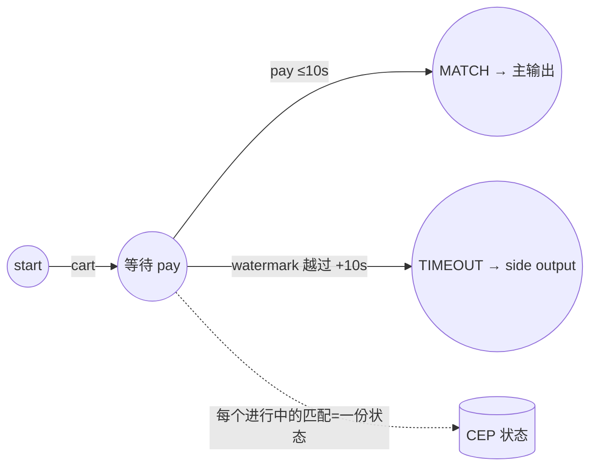

# e10 · CEP 复杂事件处理(5 案例)

> 对应教材:[docs/10-cep](../../docs/10-cep/README.md) · Level:L5
> 运行:`mvn -q -Plocal compile exec:java -pl e10-cep -Dexec.mainClass=com.flywhl.flinklab.e10.<类名>`

## 1. 背景与案例矩阵

CEP 的本质:把"事件序列的形状"编译成 NFA(非确定有限自动机),在 keyed 流上增量匹配。它擅长**跨事件的时序关系**(窗口聚合与 SQL 都不擅长的领域),尤其是"某事之后没发生某事"。

| # | 类 | 主题 | 关键观察 |
|---|---|---|---|
| C1 | C1TripleHighSpendJob | times(3).consecutive() | 严格三连;去掉 consecutive 命中变多 |
| C2 | C2ContiguityCompareJob | next vs followedBy | 同流双模式:NEXT 命中 ⊆ FOLLOWED 命中 |
| C3 | C3TimeoutSideOutputJob | 超时半成品旁路 | CONVERTED 主流 + ABANDONED-CART 侧流,"没发生"变商业动作 |
| C4 | C4IterativeRisingJob | IterativeCondition | 三连涨;相对条件必须回看已捕获事件 |
| C5 | C5VehicleDtcPatternJob | 车联网告警雏形 | 激烈驾驶→故障 关联告警,p03 模式库第一条 |

## 2. NFA 心智模型

## 3~5. 验证 / 讲解 / 踩坑

- **事件时间驱动**:CEP 的 within 与超时都由 watermark 推进;watermark 停 = 匹配与超时全停(02 模块联动)。
- **连接语义三级**:next(紧邻)⊂ followedBy(可穿插)⊂ followedByAny(含已匹配,组合爆炸)。默认选 followedBy;Any 需给出状态上界论证。
- **AfterMatchSkipStrategy**:匹配后从哪继续(noSkip/skipPastLastEvent/skipToFirst...)决定重叠匹配数量——量词+宽松连接时必须显式指定,否则输出量与状态都可能超预期。
- **性能红线**:oneOrMore + 复杂 IterativeCondition + followedByAny 是三害齐聚;进行中的部分匹配都是状态,within 就是它们的 TTL——**没有 within 的模式禁止上生产**。
- 动态化路线:开源 CEP 的 Pattern 编译期固定;运行期换规则 = Broadcast(e03-C7)选择预编译模式集,或升级到商业版动态 CEP;p03 将给出前者的完整实现。

## 6~8. 最佳实践 / 面试题 / 参考

实践:每条模式登记「业务含义 / within / 连接语义 / skip 策略 / 状态上界」五元组进评审。
面试:① NFA 里"部分匹配"何时释放?② followedBy 与 interval join 都能做"A 后 B",何时选谁?(提示:B 依赖 A 的捕获内容/需要超时旁路 → CEP)③ within 超时的事件时间语义由什么驱动?
参考:官方 Libs→CEP(Pattern API/Quantifiers/After Match Skip);e10 源码;docs/10。
