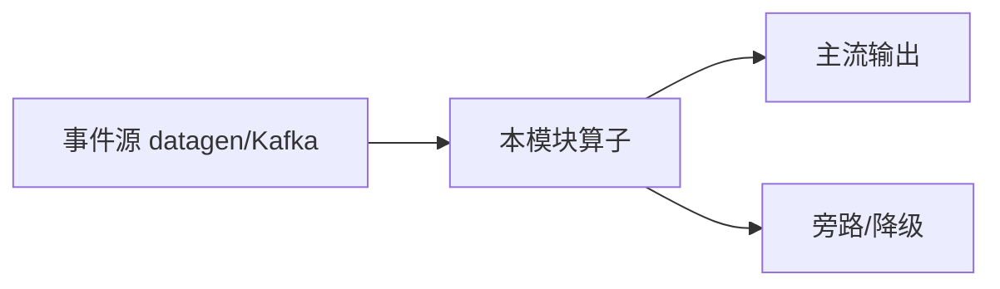

# e12-03 · Streaming Inference:CREATE MODEL + ML_PREDICT(SQL 脚本)

> 对应 [ai/chapters/03-streaming-inference.md](../../ai/chapters/03-streaming-inference.md) · Level:L4
> 形态:SQL 脚本(不进 Maven modules,与 e09 同类);前置:本机 Ollama + qwen3:8b。

## 执行方式

```bash
ollama pull qwen3:8b && ollama serve       # 宿主机(若未常驻)
cd docker && make up && make sql           # 进入 SQL Client
# 依次粘贴 sql/01-create-model.sql、sql/02-streaming-predict.sql
```

## 预期现象

每秒 1 条评论文本流入,数秒内输出携带 `risk_level` 列(HIGH/MEDIUM/LOW)。首次调用因模型加载会明显偏慢(本机 Ollama 冷启动),属预期。

## 版本演进风险与降级路径(务必阅读)

1. `CREATE MODEL` 的 WITH 参数键名在 Flink 2.1→2.3 间存在调整,执行报错时先对照当前版本官方文档(SQL → Model Inference)核对参数名,而不是怀疑 Ollama。
2. datagen 生成的随机文本对分类器没有真实语义,本 Demo 验证的是**管道贯通**而非分类效果;接真实数据源(Kafka topic)后才有业务意义。
3. 降级路径:若 SQL AI 函数在当前版本不可用,用 e11 Async I/O(RichAsyncFunction + Ollama HTTP `/api/chat`)手工实现等价逻辑——ai/03 第 4 节有完整论述。

## 工程红线回顾(ai/03 第 3 节)

限流(rows-per-second 已示范)、超时降级、批化、成本可见性——四条红线在把本脚本改造成生产作业前必须逐条落实。

---

# e12-03-streaming-inference · 八段式扩写（Wave 2）

## 1. 背景

本模块演示「流式推理 SQL/脚本入口」。目标是在零依赖或受控依赖下跑通机制，而不是堆模型。对应教材章节：`../../ai/chapters/`（ai/03）。生产降级对照 p01。

## 2. 架构



算子链保持可观测：主流契约稳定，超时/拒识/超预算走旁路。主类焦点：SQL 脚本不计 main；对照 DataStream 推理作业。

## 3. 代码锚点

阅读 `src/main/java/**/*.java` 中带 `public static void main` 的作业；注意 `.uid(...)` 与旁路 OutputTag。模块坐标：`examples/e12-03-streaming-inference`。

## 4. 启动

```bash
(cd docker && docker compose up -d)  # 若需要基座
(cd examples && mvn -pl e12-03-streaming-inference -am -DskipTests package)
# 提交主类见下方表格；OrbStack arm64 实测
```

## 5. 验证

- UI RUNNING
- 主流有输出；注入故障后旁路有信号
- `mvn -pl e12-03-streaming-inference -am -DskipTests compile` 通过
- 不引入违禁词

## 6. 踩坑

| 症状 | 根因 | 处置 |
|---|---|---|
| 作业起不来 | 类路径/主类 | 核对 pom 与 -c |
| 无输出 | 源无数据/过滤过严 | 查 datagen 与旁路 |
| 外呼拖死 | 同步阻塞 | 改 Async / 降级 |
| 成本飙升 | 无预算门控 | 软顶+降采样 |

## 7. 最佳实践

- 有状态算子固定 uid；见 `../../best-practice/02-uid-savepoint.md`
- AI/外呼路径必须可降级；见 `../../best-practice/08-ai-degrade.md`
- 反压按三步法；见 `../../best-practice/05-backpressure.md`
- 交叉教材：`../../docs/` 与 `../../ai/chapters/`

## 8. 面试题

对应 `../../interview/L8.md`（AI）或模块相关 Level；用 90 秒讲清定义→机制→反例→仓库路径。


## 深潜 1

围绕「流式推理 SQL/脚本入口」第 1 个决策点：延迟预算、成本、正确性、降级、可观测。写出若相反选择会发生什么，并指出本模块哪个类可演示。

## 深潜 2

围绕「流式推理 SQL/脚本入口」第 2 个决策点：延迟预算、成本、正确性、降级、可观测。写出若相反选择会发生什么，并指出本模块哪个类可演示。

## 深潜 3

围绕「流式推理 SQL/脚本入口」第 3 个决策点：延迟预算、成本、正确性、降级、可观测。写出若相反选择会发生什么，并指出本模块哪个类可演示。

## 深潜 4

围绕「流式推理 SQL/脚本入口」第 4 个决策点：延迟预算、成本、正确性、降级、可观测。写出若相反选择会发生什么，并指出本模块哪个类可演示。

## 深潜 5

围绕「流式推理 SQL/脚本入口」第 5 个决策点：延迟预算、成本、正确性、降级、可观测。写出若相反选择会发生什么，并指出本模块哪个类可演示。

## 与生产项目对照

- p01：`../../projects/p01-log-ai-platform/README.md`（AI off 默认可跑）
- p02：特征/召回对照（若主题相关）
- 规范：`../../best-practice/08-ai-degrade.md`

## 验证记录模板

日期 / 环境 OrbStack / 命令 / 期望 / 实际 / 日志路径。通过后才可在笔记中勾选本模块。

