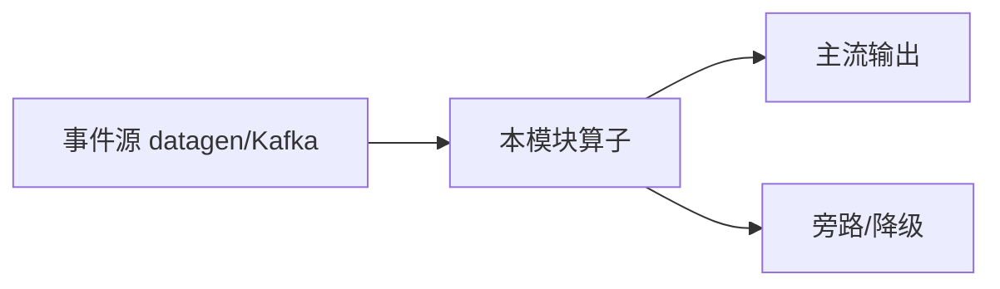

# e12-04 · Streaming Embedding + Vector:流式向量化与 VECTOR_SEARCH(SQL 脚本)

> 对应 [ai/chapters/04](../../ai/chapters/04-streaming-embedding-vector.md) 与 [ai/chapters/05](../../ai/chapters/05-streaming-rag.md) · Level:L4-L5
> 形态:SQL 脚本;前置:本机 Ollama(bge-m3)+ Milvus(`cd docker && make up-ai`)。

## 执行方式

```bash
ollama pull bge-m3
cd docker && make up && make up-ai && make sql
# 依次粘贴 sql/01 → 02 → 03;05-retraction.sql 为第 5 章失效通道演示
```

## 预期现象

02 执行后 Milvus WebUI(http://localhost:9091/webui/)可见 `tickets` collection 行数增长;03 执行后每条新工单输出其 top-5 相似历史工单(冷启动初期结果少,属预期,历史向量需要积累)。

## 版本演进风险与降级路径(务必阅读)

1. **Milvus 连接器**:Flink 官方向量存储连接器在 2.2 系列仍快速演进,`WITH` 参数为示意写法,执行前对照当前版本文档;连接器不可用时降级为 e11 Async I/O + Milvus Java SDK(流式 upsert 与检索均可等价实现)。
2. **embedding 模型一致性红线**(ai/04 要点 1):写入与检索必须用同一 embedding 模型版本,换模型必须重建索引——这是向量系统最隐蔽的事故模式。
3. `05-retraction.sql` 的软删除是普适方案;若连接器支持 DELETE 语义,物理删除+软删除双保险更稳。

## 与 e12-03 的关系

e12-03 验证"文本→生成式推理"管道;本模块验证"文本→向量→检索"管道。两者共享 CREATE MODEL 机制,区别只在 task 类型与下游用法。

---

# e12-04-streaming-inference-vector · 八段式扩写（Wave 2）

## 1. 背景

本模块演示「向量推理入口」。目标是在零依赖或受控依赖下跑通机制，而不是堆模型。对应教材章节：`../../ai/chapters/`（ai/04）。生产降级对照 p01。

## 2. 架构



算子链保持可观测：主流契约稳定，超时/拒识/超预算走旁路。主类焦点：向量字段与检索对照。

## 3. 代码锚点

阅读 `src/main/java/**/*.java` 中带 `public static void main` 的作业；注意 `.uid(...)` 与旁路 OutputTag。模块坐标：`examples/e12-04-streaming-inference-vector`。

## 4. 启动

```bash
(cd docker && docker compose up -d)  # 若需要基座
(cd examples && mvn -pl e12-04-streaming-inference-vector -am -DskipTests package)
# 提交主类见下方表格；OrbStack arm64 实测
```

## 5. 验证

- UI RUNNING
- 主流有输出；注入故障后旁路有信号
- `mvn -pl e12-04-streaming-inference-vector -am -DskipTests compile` 通过
- 不引入违禁词

## 6. 踩坑

| 症状 | 根因 | 处置 |
|---|---|---|
| 作业起不来 | 类路径/主类 | 核对 pom 与 -c |
| 无输出 | 源无数据/过滤过严 | 查 datagen 与旁路 |
| 外呼拖死 | 同步阻塞 | 改 Async / 降级 |
| 成本飙升 | 无预算门控 | 软顶+降采样 |

## 7. 最佳实践

- 有状态算子固定 uid；见 `../../best-practice/02-uid-savepoint.md`
- AI/外呼路径必须可降级；见 `../../best-practice/08-ai-degrade.md`
- 反压按三步法；见 `../../best-practice/05-backpressure.md`
- 交叉教材：`../../docs/` 与 `../../ai/chapters/`

## 8. 面试题

对应 `../../interview/L8.md`（AI）或模块相关 Level；用 90 秒讲清定义→机制→反例→仓库路径。


## 深潜 1

围绕「向量推理入口」第 1 个决策点：延迟预算、成本、正确性、降级、可观测。写出若相反选择会发生什么，并指出本模块哪个类可演示。

## 深潜 2

围绕「向量推理入口」第 2 个决策点：延迟预算、成本、正确性、降级、可观测。写出若相反选择会发生什么，并指出本模块哪个类可演示。

## 深潜 3

围绕「向量推理入口」第 3 个决策点：延迟预算、成本、正确性、降级、可观测。写出若相反选择会发生什么，并指出本模块哪个类可演示。

## 深潜 4

围绕「向量推理入口」第 4 个决策点：延迟预算、成本、正确性、降级、可观测。写出若相反选择会发生什么，并指出本模块哪个类可演示。

## 深潜 5

围绕「向量推理入口」第 5 个决策点：延迟预算、成本、正确性、降级、可观测。写出若相反选择会发生什么，并指出本模块哪个类可演示。

## 与生产项目对照

- p01：`../../projects/p01-log-ai-platform/README.md`（AI off 默认可跑）
- p02：特征/召回对照（若主题相关）
- 规范：`../../best-practice/08-ai-degrade.md`

## 验证记录模板

日期 / 环境 OrbStack / 命令 / 期望 / 实际 / 日志路径。通过后才可在笔记中勾选本模块。

