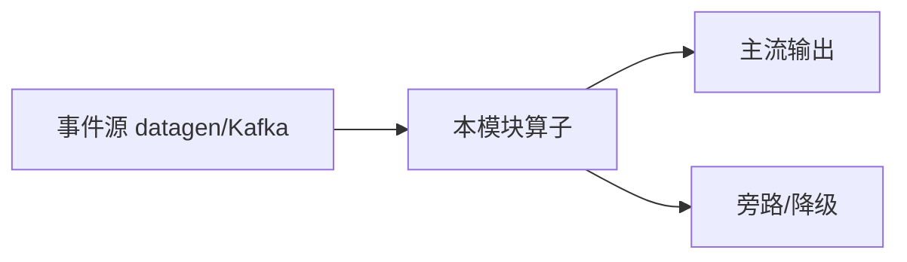

# e12-07 · Flink Agents 快速上手(standalone · Preview)

> 对应 [ai/chapters/07-agent-quickstart.md](../../ai/chapters/07-agent-quickstart.md) · Level:L5
> ⚠️ **本模块是独立 Maven 工程,不在 examples 父 pom 的 `<modules>` 聚合内**——Flink Agents 0.3.0 为 Preview,隔离于主构建之外,保证主流程 `mvn clean package` 永不被 Preview 依赖阻塞。父 pom properties 已登记 `flink.agents.version=0.3.0` 注释作为版本 SSOT。

## 运行方式

```bash
cd examples/e12-07-agent-quickstart
mvn -q compile exec:java -Dexec.mainClass=com.flywhl.flinklab.e12.AgentQuickstartJob \
    -Dexec.jvmArgs="--add-exports=java.base/jdk.internal.vm=ALL-UNNAMED"
```

IDE 内运行需开启 "add dependencies with provided scope to classpath"(依赖全部 provided,官方 Installation 文档模式;`flink-agents-ide-support` 即为此场景提供的运行时聚合坐标)。

## 三份文件

| 文件 | 职责 |
|---|---|
| VehicleSignal.java | 输入 POJO(事件契约) |
| SimpleThresholdAgent.java | 最小 Agent:@Action 监听 InputEvent,超阈值发 OutputEvent |
| AgentQuickstartJob.java | 装配:AgentsExecutionEnvironment 包裹 Flink 环境 |

## 已知限制与降级路径(务必阅读)

1. **未经编译验证**:沙箱环境无 Maven Central 访问,本模块代码依据官方 0.3 发布说明、Installation/Quickstart 文档与 GitHub Discussion #429 整理,`fromDataStream(...).apply(...)` 等链式调用的确切签名可能与 0.3.0 实际 API 存在偏差——首次编译报错时,以 `flink-agents-examples` 官方示例源码为准做机械调整,核心概念(Agent/@Action/Event/RunnerContext)不变。
2. **JVM 参数必须保留**:`--add-exports=java.base/jdk.internal.vm=ALL-UNNAMED` 是 JDK 21 下 Continuation 机制的硬性要求(官方 Quickstart 明示);集群模式追加到 `config.yaml` 的 `env.java.opts.all`。
3. **Action State Store**:0.3 起无隐式默认后端;本最小示例(LocalRunner 路径)不涉及,部署到集群启用 exactly-once 时须显式配置 Kafka 或 Fluss。
4. **降级路径**:若 Agents 依赖不可用,e03-C7(Broadcast State)+ e11(Async I/O)可手工搭建等价的"事件驱动决策"骨架(ai/07 第 5 节)。

## 面试题

见 ai/chapters/07-agent-quickstart.md 第 8 节。

---

# e12-07-agent-quickstart · 八段式扩写（Wave 2）

## 1. 背景

本模块演示「Agent 快速入门（standalone）」。目标是在零依赖或受控依赖下跑通机制，而不是堆模型。对应教材章节：`../../ai/chapters/`（ai/07）。生产降级对照 p01。

## 2. 架构



算子链保持可观测：主流契约稳定，超时/拒识/超预算走旁路。主类焦点：Preview 依赖隔离。

## 3. 代码锚点

阅读 `src/main/java/**/*.java` 中带 `public static void main` 的作业；注意 `.uid(...)` 与旁路 OutputTag。模块坐标：`examples/e12-07-agent-quickstart`。

## 4. 启动

```bash
(cd docker && docker compose up -d)  # 若需要基座
(cd examples && mvn -pl e12-07-agent-quickstart -am -DskipTests package)
# 提交主类见下方表格；OrbStack arm64 实测
```

## 5. 验证

- UI RUNNING
- 主流有输出；注入故障后旁路有信号
- `mvn -pl e12-07-agent-quickstart -am -DskipTests compile` 通过
- 不引入违禁词

## 6. 踩坑

| 症状 | 根因 | 处置 |
|---|---|---|
| 作业起不来 | 类路径/主类 | 核对 pom 与 -c |
| 无输出 | 源无数据/过滤过严 | 查 datagen 与旁路 |
| 外呼拖死 | 同步阻塞 | 改 Async / 降级 |
| 成本飙升 | 无预算门控 | 软顶+降采样 |

## 7. 最佳实践

- 有状态算子固定 uid；见 `../../best-practice/02-uid-savepoint.md`
- AI/外呼路径必须可降级；见 `../../best-practice/08-ai-degrade.md`
- 反压按三步法；见 `../../best-practice/05-backpressure.md`
- 交叉教材：`../../docs/` 与 `../../ai/chapters/`

## 8. 面试题

对应 `../../interview/L8.md`（AI）或模块相关 Level；用 90 秒讲清定义→机制→反例→仓库路径。


## 深潜 1

围绕「Agent 快速入门（standalone）」第 1 个决策点：延迟预算、成本、正确性、降级、可观测。写出若相反选择会发生什么，并指出本模块哪个类可演示。

## 深潜 2

围绕「Agent 快速入门（standalone）」第 2 个决策点：延迟预算、成本、正确性、降级、可观测。写出若相反选择会发生什么，并指出本模块哪个类可演示。

## 深潜 3

围绕「Agent 快速入门（standalone）」第 3 个决策点：延迟预算、成本、正确性、降级、可观测。写出若相反选择会发生什么，并指出本模块哪个类可演示。

## 深潜 4

围绕「Agent 快速入门（standalone）」第 4 个决策点：延迟预算、成本、正确性、降级、可观测。写出若相反选择会发生什么，并指出本模块哪个类可演示。

## 深潜 5

围绕「Agent 快速入门（standalone）」第 5 个决策点：延迟预算、成本、正确性、降级、可观测。写出若相反选择会发生什么，并指出本模块哪个类可演示。

## 与生产项目对照

- p01：`../../projects/p01-log-ai-platform/README.md`（AI off 默认可跑）
- p02：特征/召回对照（若主题相关）
- 规范：`../../best-practice/08-ai-degrade.md`

## 验证记录模板

日期 / 环境 OrbStack / 命令 / 期望 / 实际 / 日志路径。通过后才可在笔记中勾选本模块。

