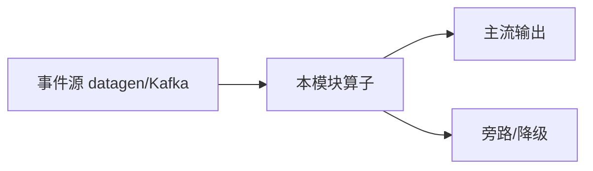

# e12-08 · Streaming Memory:短期记忆读写(standalone · Preview)

> 对应 [ai/chapters/08-streaming-memory.md](../../ai/chapters/08-streaming-memory.md) · Level:L5
> ⚠️ 独立 Maven 工程,不进父 pom 聚合(理由同 e12-07:Preview 依赖隔离)。

## 运行方式

```bash
cd examples/e12-08-streaming-memory
mvn -q compile exec:java -Dexec.mainClass=com.flywhl.flinklab.e12.StreamingMemoryJob \
    -Dexec.jvmArgs="--add-exports=java.base/jdk.internal.vm=ALL-UNNAMED"
```

## 预期现象

每个 vin 的第 1 条输出 `trend=FIRST`,第 2 条起输出 `RISING/FALLING/FLAT` 并携带 `prev=` 上一次的值——证明短期记忆跨多次 Agent 运行保留,且按 key(vin)相互隔离。

## 三层记忆覆盖说明

| 层 | 本 Demo 覆盖情况 |
|---|---|
| Sensory | 方法局部变量(隐式演示) |
| Short-Term | ✅ 核心演示对象(get/set + keyBy 隔离);TTL 配置见 ai/08 第 3 节,属集群部署配置 |
| Long-Term(Mem0) | 未演示——需外部 Mem0 服务/API Key;代码形态见 ai/08 第 4 节,0.3 起长期记忆统一收敛到 Mem0 后端 |

## 已知限制与降级路径

同 e12-07 第 1/2 条(未经编译验证、JVM 参数必需)。短期记忆场景的降级路径最直接:手写 e03-C6 风格的 `ValueState` + TTL,语义完全等价——本 Demo 的价值在于展示 Agents 框架把这套模式托管后的开发体验差异。

## 面试题

见 ai/chapters/08-streaming-memory.md 第 8 节。

---

# e12-08-streaming-memory · 八段式扩写（Wave 2）

## 1. 背景

本模块演示「流式记忆」。目标是在零依赖或受控依赖下跑通机制，而不是堆模型。对应教材章节：`../../ai/chapters/`（ai/08）。生产降级对照 p01。

## 2. 架构



算子链保持可观测：主流契约稳定，超时/拒识/超预算走旁路。主类焦点：会话记忆状态与 TTL。

## 3. 代码锚点

阅读 `src/main/java/**/*.java` 中带 `public static void main` 的作业；注意 `.uid(...)` 与旁路 OutputTag。模块坐标：`examples/e12-08-streaming-memory`。

## 4. 启动

```bash
(cd docker && docker compose up -d)  # 若需要基座
(cd examples && mvn -pl e12-08-streaming-memory -am -DskipTests package)
# 提交主类见下方表格；OrbStack arm64 实测
```

## 5. 验证

- UI RUNNING
- 主流有输出；注入故障后旁路有信号
- `mvn -pl e12-08-streaming-memory -am -DskipTests compile` 通过
- 不引入违禁词

## 6. 踩坑

| 症状 | 根因 | 处置 |
|---|---|---|
| 作业起不来 | 类路径/主类 | 核对 pom 与 -c |
| 无输出 | 源无数据/过滤过严 | 查 datagen 与旁路 |
| 外呼拖死 | 同步阻塞 | 改 Async / 降级 |
| 成本飙升 | 无预算门控 | 软顶+降采样 |

## 7. 最佳实践

- 有状态算子固定 uid；见 `../../best-practice/02-uid-savepoint.md`
- AI/外呼路径必须可降级；见 `../../best-practice/08-ai-degrade.md`
- 反压按三步法；见 `../../best-practice/05-backpressure.md`
- 交叉教材：`../../docs/` 与 `../../ai/chapters/`

## 8. 面试题

对应 `../../interview/L8.md`（AI）或模块相关 Level；用 90 秒讲清定义→机制→反例→仓库路径。


## 深潜 1

围绕「流式记忆」第 1 个决策点：延迟预算、成本、正确性、降级、可观测。写出若相反选择会发生什么，并指出本模块哪个类可演示。

## 深潜 2

围绕「流式记忆」第 2 个决策点：延迟预算、成本、正确性、降级、可观测。写出若相反选择会发生什么，并指出本模块哪个类可演示。

## 深潜 3

围绕「流式记忆」第 3 个决策点：延迟预算、成本、正确性、降级、可观测。写出若相反选择会发生什么，并指出本模块哪个类可演示。

## 深潜 4

围绕「流式记忆」第 4 个决策点：延迟预算、成本、正确性、降级、可观测。写出若相反选择会发生什么，并指出本模块哪个类可演示。

## 深潜 5

围绕「流式记忆」第 5 个决策点：延迟预算、成本、正确性、降级、可观测。写出若相反选择会发生什么，并指出本模块哪个类可演示。

## 与生产项目对照

- p01：`../../projects/p01-log-ai-platform/README.md`（AI off 默认可跑）
- p02：特征/召回对照（若主题相关）
- 规范：`../../best-practice/08-ai-degrade.md`

## 验证记录模板

日期 / 环境 OrbStack / 命令 / 期望 / 实际 / 日志路径。通过后才可在笔记中勾选本模块。

