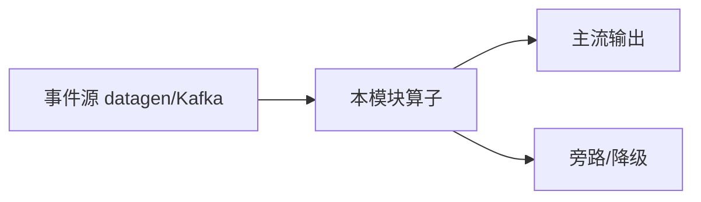

# e12-09 · Streaming Tool Call（幂等键 + 副作用侧输出）

> 对应 [ai/chapters/09-streaming-tool-call.md](../../ai/chapters/09-streaming-tool-call.md) · Level:L2–L3
> 运行:`mvn -q -Plocal compile exec:java -pl e12-09-streaming-tool-call -Dexec.mainClass=com.flywhl.flinklab.e12.StreamingToolCallJob`

## 背景

Tool Call 的核心风险是副作用重复：checkpoint 重放或至少一次投递会导致重复发券。本章降级路径不依赖 Agents Reconciler，用幂等键 ValueState + Side Output 演示「动作可审计、重放不重做」。

## 架构

```
Event → keyBy(user|page) → ValueState 幂等 → 主流通审计 / Side Output 副作用
```

本 Demo **零外部依赖**：源为 `Labs.events` / datagen，状态在 Flink Keyed/Broadcast State 内完成，不引入 Milvus、Ollama、flink-agents Preview 坐标，保证进主 `examples/pom.xml` 聚合构建可编译。

## 代码锚点

- 主类：`com.flywhl.flinklab.e12.StreamingToolCallJob`
- 关键算子 `.uid("e12-09-…")` 与 `env.execute("e12-09-…")`，便于 Savepoint / 观测对齐
- 包名统一 `com.flywhl.flinklab.e12`，与既有 e12-01/17/22 一致

## 启动

```bash
cd examples
mvn -q -Plocal compile exec:java -pl e12-09-streaming-tool-call \
  -Dexec.mainClass=com.flywhl.flinklab.e12.StreamingToolCallJob
```

本地 profile 将 `provided` 作用域的 Flink 依赖提升为可执行 classpath；集群提交仍走 shade jar + `flink run`。

## 验证

同一 user+page 首次高金额出现 `OK` + `SIDE-EFFECT`；后续同键出现 `SKIP`。低金额出现 `HOLD`。

## 源码讲解

关键路径：无界事件进入 → 按业务 key 分区 → 状态算子完成教学点逻辑 → `print()` 观察结果。
所有教学断言都体现在输出前缀（如 HIT/MISS、PASS/BLOCK、SAMPLE），便于肉眼与脚本 grep。

## 踩坑

- 幂等键粒度选错（过粗吞掉合法重试，过细仍重复）。
- 把副作用写在主流通而不用侧输出，难与业务审计解耦。

## 最佳实践

- 副作用与审计分流；状态只记「是否已做」。
- 生产把 Side Output 接到 Kafka/工单系统，仍保持幂等键。

## 面试题

1) 幂等键与 exactly-once sink 的关系？2) Side Output 适合承载哪些副作用？3) Agents Reconciler 相对本降级路径多解决了什么？

见 ai/chapters/09-streaming-tool-call.md 对应小节；本 README 只固化与本 Demo 可对照的考点。

## 参考

- 仓库内：`examples/e12-01-polling-vs-event/`（零依赖骨架）、`examples/e12-17-streaming-guardrail/`（Broadcast）
- 版本 SSOT：根 README 版本矩阵 + `examples/pom.xml` 属性区（Flink 2.2.1 / JDK 21）

---

# e12-09-streaming-tool-call · 八段式扩写（Wave 2）

## 1. 背景

本模块演示「流式工具调用」。目标是在零依赖或受控依赖下跑通机制，而不是堆模型。对应教材章节：`../../ai/chapters/`（ai/09）。生产降级对照 p01。

## 2. 架构



算子链保持可观测：主流契约稳定，超时/拒识/超预算走旁路。主类焦点：ToolCall + RateLimit。

## 3. 代码锚点

阅读 `src/main/java/**/*.java` 中带 `public static void main` 的作业；注意 `.uid(...)` 与旁路 OutputTag。模块坐标：`examples/e12-09-streaming-tool-call`。

## 4. 启动

```bash
(cd docker && docker compose up -d)  # 若需要基座
(cd examples && mvn -pl e12-09-streaming-tool-call -am -DskipTests package)
# 提交主类见下方表格；OrbStack arm64 实测
```

## 5. 验证

- UI RUNNING
- 主流有输出；注入故障后旁路有信号
- `mvn -pl e12-09-streaming-tool-call -am -DskipTests compile` 通过
- 不引入违禁词

## 6. 踩坑

| 症状 | 根因 | 处置 |
|---|---|---|
| 作业起不来 | 类路径/主类 | 核对 pom 与 -c |
| 无输出 | 源无数据/过滤过严 | 查 datagen 与旁路 |
| 外呼拖死 | 同步阻塞 | 改 Async / 降级 |
| 成本飙升 | 无预算门控 | 软顶+降采样 |

## 7. 最佳实践

- 有状态算子固定 uid；见 `../../best-practice/02-uid-savepoint.md`
- AI/外呼路径必须可降级；见 `../../best-practice/08-ai-degrade.md`
- 反压按三步法；见 `../../best-practice/05-backpressure.md`
- 交叉教材：`../../docs/` 与 `../../ai/chapters/`

## 8. 面试题

对应 `../../interview/L8.md`（AI）或模块相关 Level；用 90 秒讲清定义→机制→反例→仓库路径。


## 深潜 1

围绕「流式工具调用」第 1 个决策点：延迟预算、成本、正确性、降级、可观测。写出若相反选择会发生什么，并指出本模块哪个类可演示。

## 深潜 2

围绕「流式工具调用」第 2 个决策点：延迟预算、成本、正确性、降级、可观测。写出若相反选择会发生什么，并指出本模块哪个类可演示。

## 深潜 3

围绕「流式工具调用」第 3 个决策点：延迟预算、成本、正确性、降级、可观测。写出若相反选择会发生什么，并指出本模块哪个类可演示。

## 深潜 4

围绕「流式工具调用」第 4 个决策点：延迟预算、成本、正确性、降级、可观测。写出若相反选择会发生什么，并指出本模块哪个类可演示。

## 深潜 5

围绕「流式工具调用」第 5 个决策点：延迟预算、成本、正确性、降级、可观测。写出若相反选择会发生什么，并指出本模块哪个类可演示。

## 与生产项目对照

- p01：`../../projects/p01-log-ai-platform/README.md`（AI off 默认可跑）
- p02：特征/召回对照（若主题相关）
- 规范：`../../best-practice/08-ai-degrade.md`

## 验证记录模板

日期 / 环境 OrbStack / 命令 / 期望 / 实际 / 日志路径。通过后才可在笔记中勾选本模块。

