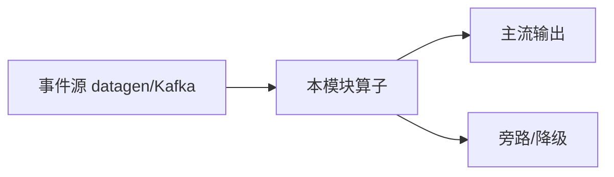

# e12-17 · Streaming Guardrail:流式内容护栏

> 对应 [ai/chapters/17-streaming-guardrail.md](../../ai/chapters/17-streaming-guardrail.md) · Level:L4
> 运行:`mvn -q -Plocal compile exec:java -pl e12-17-streaming-guardrail -Dexec.mainClass=com.flywhl.flinklab.e12.StreamingGuardrailJob`

## 背景

完整复用 e03-C7 Broadcast State 骨架,把"车辆信号阈值"换成"LLM 输出内容审查"——证明同一套动态规则机制可以跨领域直接复用。用随机文本模拟 LLM 输出,避免依赖外部模型服务。

## 验证方式

观察 `RULE-UPDATED` 日志出现的时间点,对照其后 `BLOCK` 行是否命中新规则的关键词(`泄露内部信息`)——命中即证明热更新生效,无需重启作业。

## 源码要点

- 与 e03-C7 唯一的实质差异是业务领域(信号阈值 → 关键词黑名单),底层 Broadcast State 机制完全相同。
- 生产版本应叠加第 17 章讲的三层护栏设计(输入/输出/行为),本 Demo 只演示输出护栏这一层。

## 面试题

见 ai/chapters/17-streaming-guardrail.md 第 8 节。

---

# e12-17-streaming-guardrail · 八段式扩写（Wave 2）

## 1. 背景

本模块演示「流式护栏」。目标是在零依赖或受控依赖下跑通机制，而不是堆模型。对应教材章节：`../../ai/chapters/`（ai/17）。生产降级对照 p01。

## 2. 架构



算子链保持可观测：主流契约稳定，超时/拒识/超预算走旁路。主类焦点：Guardrail + Score。

## 3. 代码锚点

阅读 `src/main/java/**/*.java` 中带 `public static void main` 的作业；注意 `.uid(...)` 与旁路 OutputTag。模块坐标：`examples/e12-17-streaming-guardrail`。

## 4. 启动

```bash
(cd docker && docker compose up -d)  # 若需要基座
(cd examples && mvn -pl e12-17-streaming-guardrail -am -DskipTests package)
# 提交主类见下方表格；OrbStack arm64 实测
```

## 5. 验证

- UI RUNNING
- 主流有输出；注入故障后旁路有信号
- `mvn -pl e12-17-streaming-guardrail -am -DskipTests compile` 通过
- 不引入违禁词

## 6. 踩坑

| 症状 | 根因 | 处置 |
|---|---|---|
| 作业起不来 | 类路径/主类 | 核对 pom 与 -c |
| 无输出 | 源无数据/过滤过严 | 查 datagen 与旁路 |
| 外呼拖死 | 同步阻塞 | 改 Async / 降级 |
| 成本飙升 | 无预算门控 | 软顶+降采样 |

## 7. 最佳实践

- 有状态算子固定 uid；见 `../../best-practice/02-uid-savepoint.md`
- AI/外呼路径必须可降级；见 `../../best-practice/08-ai-degrade.md`
- 反压按三步法；见 `../../best-practice/05-backpressure.md`
- 交叉教材：`../../docs/` 与 `../../ai/chapters/`

## 8. 面试题

对应 `../../interview/L8.md`（AI）或模块相关 Level；用 90 秒讲清定义→机制→反例→仓库路径。


## 深潜 1

围绕「流式护栏」第 1 个决策点：延迟预算、成本、正确性、降级、可观测。写出若相反选择会发生什么，并指出本模块哪个类可演示。

## 深潜 2

围绕「流式护栏」第 2 个决策点：延迟预算、成本、正确性、降级、可观测。写出若相反选择会发生什么，并指出本模块哪个类可演示。

## 深潜 3

围绕「流式护栏」第 3 个决策点：延迟预算、成本、正确性、降级、可观测。写出若相反选择会发生什么，并指出本模块哪个类可演示。

## 深潜 4

围绕「流式护栏」第 4 个决策点：延迟预算、成本、正确性、降级、可观测。写出若相反选择会发生什么，并指出本模块哪个类可演示。

## 深潜 5

围绕「流式护栏」第 5 个决策点：延迟预算、成本、正确性、降级、可观测。写出若相反选择会发生什么，并指出本模块哪个类可演示。

## 与生产项目对照

- p01：`../../projects/p01-log-ai-platform/README.md`（AI off 默认可跑）
- p02：特征/召回对照（若主题相关）
- 规范：`../../best-practice/08-ai-degrade.md`

## 验证记录模板

日期 / 环境 OrbStack / 命令 / 期望 / 实际 / 日志路径。通过后才可在笔记中勾选本模块。

