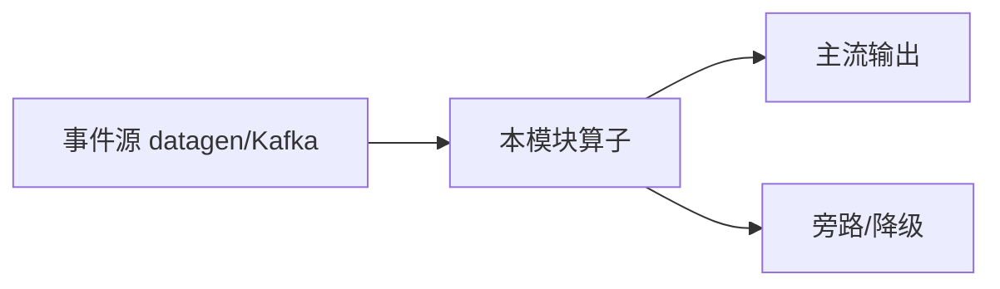

# e12-18 · Streaming Cost Control:Token 计量与预算熔断

> 对应 [ai/chapters/18-streaming-cost-control.md](../../ai/chapters/18-streaming-cost-control.md) · Level:L4
> 运行:`mvn -q -Plocal compile exec:java -pl e12-18-streaming-cost-control -Dexec.mainClass=com.flywhl.flinklab.e12.StreamingCostControlJob`

## 背景

组合复用 e02(滚动窗口)与"计量流水"概念(生产版本落 ClickHouse,复用 e07-C6),用模拟 token 数代替真实 LLM 调用,证明"计量+窗口聚合+预算熔断"这条链路的可行性,零外部依赖。

## 验证方式

`tenant-A`(70% 流量占比)应比 `tenant-B` 更早触发 `BUDGET-EXCEEDED`;`OK` 行显示未超预算租户的窗口成本。

## 源码要点

- `BUDGET_PER_MINUTE_USD` 刻意设置得很低,便于短时间内观察到熔断触发;生产环境按真实预算设定。
- 生产版本的降级动作(第 18 章"分级熔断")本 Demo 未实现,仅输出建议文本,实际系统应联动 Broadcast 阈值(参照 e12-22 相同技术模式)与真实的模型切换/限流逻辑。

## 面试题

见 ai/chapters/18-streaming-cost-control.md 第 8 节。

---

# e12-18-streaming-cost-control · 八段式扩写（Wave 2）

## 1. 背景

本模块演示「成本控制」。目标是在零依赖或受控依赖下跑通机制，而不是堆模型。对应教材章节：`../../ai/chapters/`（ai/18）。生产降级对照 p01。

## 2. 架构



算子链保持可观测：主流契约稳定，超时/拒识/超预算走旁路。主类焦点：Cost + SoftCap。

## 3. 代码锚点

阅读 `src/main/java/**/*.java` 中带 `public static void main` 的作业；注意 `.uid(...)` 与旁路 OutputTag。模块坐标：`examples/e12-18-streaming-cost-control`。

## 4. 启动

```bash
(cd docker && docker compose up -d)  # 若需要基座
(cd examples && mvn -pl e12-18-streaming-cost-control -am -DskipTests package)
# 提交主类见下方表格；OrbStack arm64 实测
```

## 5. 验证

- UI RUNNING
- 主流有输出；注入故障后旁路有信号
- `mvn -pl e12-18-streaming-cost-control -am -DskipTests compile` 通过
- 不引入违禁词

## 6. 踩坑

| 症状 | 根因 | 处置 |
|---|---|---|
| 作业起不来 | 类路径/主类 | 核对 pom 与 -c |
| 无输出 | 源无数据/过滤过严 | 查 datagen 与旁路 |
| 外呼拖死 | 同步阻塞 | 改 Async / 降级 |
| 成本飙升 | 无预算门控 | 软顶+降采样 |

## 7. 最佳实践

- 有状态算子固定 uid；见 `../../best-practice/02-uid-savepoint.md`
- AI/外呼路径必须可降级；见 `../../best-practice/08-ai-degrade.md`
- 反压按三步法；见 `../../best-practice/05-backpressure.md`
- 交叉教材：`../../docs/` 与 `../../ai/chapters/`

## 8. 面试题

对应 `../../interview/L8.md`（AI）或模块相关 Level；用 90 秒讲清定义→机制→反例→仓库路径。


## 深潜 1

围绕「成本控制」第 1 个决策点：延迟预算、成本、正确性、降级、可观测。写出若相反选择会发生什么，并指出本模块哪个类可演示。

## 深潜 2

围绕「成本控制」第 2 个决策点：延迟预算、成本、正确性、降级、可观测。写出若相反选择会发生什么，并指出本模块哪个类可演示。

## 深潜 3

围绕「成本控制」第 3 个决策点：延迟预算、成本、正确性、降级、可观测。写出若相反选择会发生什么，并指出本模块哪个类可演示。

## 深潜 4

围绕「成本控制」第 4 个决策点：延迟预算、成本、正确性、降级、可观测。写出若相反选择会发生什么，并指出本模块哪个类可演示。

## 深潜 5

围绕「成本控制」第 5 个决策点：延迟预算、成本、正确性、降级、可观测。写出若相反选择会发生什么，并指出本模块哪个类可演示。

## 与生产项目对照

- p01：`../../projects/p01-log-ai-platform/README.md`（AI off 默认可跑）
- p02：特征/召回对照（若主题相关）
- 规范：`../../best-practice/08-ai-degrade.md`

## 验证记录模板

日期 / 环境 OrbStack / 命令 / 期望 / 实际 / 日志路径。通过后才可在笔记中勾选本模块。

