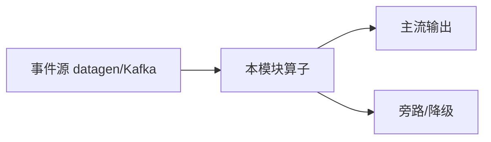

# e12-19 · AI Gateway Broadcast 路由

> 对应 [ai/chapters/19-streaming-ai-gateway.md](../../ai/chapters/19-streaming-ai-gateway.md) · Level:L2–L3
> 运行:`mvn -q -Plocal compile exec:java -pl e12-19-ai-gateway-route -Dexec.mainClass=com.flywhl.flinklab.e12.AiGatewayRouteJob`

## 背景

AI Gateway 的核心能力是按租户/成本/灰度把请求路由到不同模型，且规则可热更新。Broadcast State 正是该模式的 Flink 原生解。

## 架构

```
请求流 keyBy(user) ──┐
                     ├─ KeyedBroadcastProcess → ROUTE
路由规则 Broadcast ──┘
```

本 Demo **零外部依赖**：源为 `Labs.events` / datagen，状态在 Flink Keyed/Broadcast State 内完成，不引入 Milvus、Ollama、flink-agents Preview 坐标，保证进主 `examples/pom.xml` 聚合构建可编译。

## 代码锚点

- 主类：`com.flywhl.flinklab.e12.AiGatewayRouteJob`
- 关键算子 `.uid("e12-19-…")` 与 `env.execute("e12-19-…")`
- 包名统一 `com.flywhl.flinklab.e12`

## 启动

```bash
cd examples
mvn -q -Plocal compile exec:java -pl e12-19-ai-gateway-route \
  -Dexec.mainClass=com.flywhl.flinklab.e12.AiGatewayRouteJob
```

## 验证

先见 `RULE` 更新；随后 `ROUTE` 行按 user 前缀落到 cheap/premium/default-local。

## 源码讲解

关键路径：无界事件进入 → 业务算子 → `print()`。教学断言体现在输出前缀。

## 踩坑

- 路由规则全量进 Broadcast 要注意状态大小。
- 默认模型必须存在，避免空路由丢请求。

## 最佳实践

- 规则带版本号；观测 ROUTE 分布做成本归因。
- 与 e12-17 护栏可串联：先路由再护栏。

## 面试题

1) Broadcast vs Kafka 配置中心？2) 网关层限流放哪？3) 如何做模型灰度百分比路由？

## 参考

- `examples/e12-17-streaming-guardrail/`、`examples/e12-18-streaming-cost-control/`
- 版本 SSOT：根 README + `examples/pom.xml`（Flink 2.2.1 / JDK 21）

---

# e12-19-ai-gateway-route · 八段式扩写（Wave 2）

## 1. 背景

本模块演示「AI 网关路由」。目标是在零依赖或受控依赖下跑通机制，而不是堆模型。对应教材章节：`../../ai/chapters/`（ai/19）。生产降级对照 p01。

## 2. 架构



算子链保持可观测：主流契约稳定，超时/拒识/超预算走旁路。主类焦点：按规则分流模型。

## 3. 代码锚点

阅读 `src/main/java/**/*.java` 中带 `public static void main` 的作业；注意 `.uid(...)` 与旁路 OutputTag。模块坐标：`examples/e12-19-ai-gateway-route`。

## 4. 启动

```bash
(cd docker && docker compose up -d)  # 若需要基座
(cd examples && mvn -pl e12-19-ai-gateway-route -am -DskipTests package)
# 提交主类见下方表格；OrbStack arm64 实测
```

## 5. 验证

- UI RUNNING
- 主流有输出；注入故障后旁路有信号
- `mvn -pl e12-19-ai-gateway-route -am -DskipTests compile` 通过
- 不引入违禁词

## 6. 踩坑

| 症状 | 根因 | 处置 |
|---|---|---|
| 作业起不来 | 类路径/主类 | 核对 pom 与 -c |
| 无输出 | 源无数据/过滤过严 | 查 datagen 与旁路 |
| 外呼拖死 | 同步阻塞 | 改 Async / 降级 |
| 成本飙升 | 无预算门控 | 软顶+降采样 |

## 7. 最佳实践

- 有状态算子固定 uid；见 `../../best-practice/02-uid-savepoint.md`
- AI/外呼路径必须可降级；见 `../../best-practice/08-ai-degrade.md`
- 反压按三步法；见 `../../best-practice/05-backpressure.md`
- 交叉教材：`../../docs/` 与 `../../ai/chapters/`

## 8. 面试题

对应 `../../interview/L8.md`（AI）或模块相关 Level；用 90 秒讲清定义→机制→反例→仓库路径。


## 深潜 1

围绕「AI 网关路由」第 1 个决策点：延迟预算、成本、正确性、降级、可观测。写出若相反选择会发生什么，并指出本模块哪个类可演示。

## 深潜 2

围绕「AI 网关路由」第 2 个决策点：延迟预算、成本、正确性、降级、可观测。写出若相反选择会发生什么，并指出本模块哪个类可演示。

## 深潜 3

围绕「AI 网关路由」第 3 个决策点：延迟预算、成本、正确性、降级、可观测。写出若相反选择会发生什么，并指出本模块哪个类可演示。

## 深潜 4

围绕「AI 网关路由」第 4 个决策点：延迟预算、成本、正确性、降级、可观测。写出若相反选择会发生什么，并指出本模块哪个类可演示。

## 深潜 5

围绕「AI 网关路由」第 5 个决策点：延迟预算、成本、正确性、降级、可观测。写出若相反选择会发生什么，并指出本模块哪个类可演示。

## 与生产项目对照

- p01：`../../projects/p01-log-ai-platform/README.md`（AI off 默认可跑）
- p02：特征/召回对照（若主题相关）
- 规范：`../../best-practice/08-ai-degrade.md`

## 验证记录模板

日期 / 环境 OrbStack / 命令 / 期望 / 实际 / 日志路径。通过后才可在笔记中勾选本模块。

