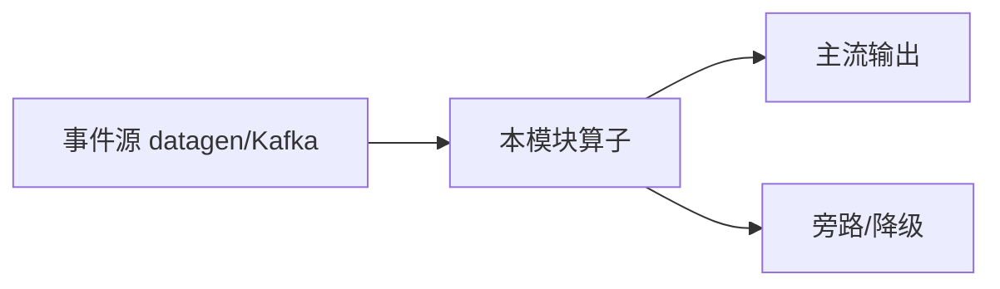

# e12-20 · Embedding Cache（LRU MapState + 命中率）

> 对应 [ai/chapters/20-streaming-embedding-cache.md](../../ai/chapters/20-streaming-embedding-cache.md) · Level:L2–L3
> 运行:`mvn -q -Plocal compile exec:java -pl e12-20-embedding-cache -Dexec.mainClass=com.flywhl.flinklab.e12.EmbeddingCacheJob`

## 背景

重复查询同一文本时，embedding 调用昂贵。本地 LRU 缓存是第一道防线；本 Demo 用 MapState 教学命中率与容量治理，不接真实模型。

## 架构

```
Event → keyBy(user) → MapState LRU(page→ts) → HIT/MISS + hitRate
```

本 Demo **零外部依赖**：源为 `Labs.events` / datagen，状态在 Flink Keyed/Broadcast State 内完成，不引入 Milvus、Ollama、flink-agents Preview 坐标，保证进主 `examples/pom.xml` 聚合构建可编译。

## 代码锚点

- 主类：`com.flywhl.flinklab.e12.EmbeddingCacheJob`
- 关键算子 `.uid("e12-20-…")` 与 `env.execute("e12-20-…")`
- 包名统一 `com.flywhl.flinklab.e12`

## 启动

```bash
cd examples
mvn -q -Plocal compile exec:java -pl e12-20-embedding-cache \
  -Dexec.mainClass=com.flywhl.flinklab.e12.EmbeddingCacheJob
```

## 验证

同一 user 重复 page 先 `MISS` 后 `HIT`；命中率逐步上升；容量满时淘汰旧页。

## 源码讲解

关键路径：无界事件进入 → 业务算子 → `print()`。教学断言体现在输出前缀。

## 踩坑

- 按 user 分区的缓存不共享跨用户语义——全局缓存需另拓扑。
- 只用处理顺序 LRU，未做 TTL；生产要双维度淘汰。

## 最佳实践

- 命中率作为自定义指标上报（本 Demo 打在日志）。
- 与 e11-C3 组合：本地 Miss 再 Async 外呼。

## 面试题

1) 语义缓存键如何设计（原文 vs hash）？2) 缓存与 embedding 模型版本绑定？3) 命中率多少才值得上 Redis？

## 参考

- `examples/e12-17-streaming-guardrail/`、`examples/e12-18-streaming-cost-control/`
- 版本 SSOT：根 README + `examples/pom.xml`（Flink 2.2.1 / JDK 21）

---

# e12-20-embedding-cache · 八段式扩写（Wave 2）

## 1. 背景

本模块演示「Embedding 缓存」。目标是在零依赖或受控依赖下跑通机制，而不是堆模型。对应教材章节：`../../ai/chapters/`（ai/20）。生产降级对照 p01。

## 2. 架构



算子链保持可观测：主流契约稳定，超时/拒识/超预算走旁路。主类焦点：TTL 缓存命中。

## 3. 代码锚点

阅读 `src/main/java/**/*.java` 中带 `public static void main` 的作业；注意 `.uid(...)` 与旁路 OutputTag。模块坐标：`examples/e12-20-embedding-cache`。

## 4. 启动

```bash
(cd docker && docker compose up -d)  # 若需要基座
(cd examples && mvn -pl e12-20-embedding-cache -am -DskipTests package)
# 提交主类见下方表格；OrbStack arm64 实测
```

## 5. 验证

- UI RUNNING
- 主流有输出；注入故障后旁路有信号
- `mvn -pl e12-20-embedding-cache -am -DskipTests compile` 通过
- 不引入违禁词

## 6. 踩坑

| 症状 | 根因 | 处置 |
|---|---|---|
| 作业起不来 | 类路径/主类 | 核对 pom 与 -c |
| 无输出 | 源无数据/过滤过严 | 查 datagen 与旁路 |
| 外呼拖死 | 同步阻塞 | 改 Async / 降级 |
| 成本飙升 | 无预算门控 | 软顶+降采样 |

## 7. 最佳实践

- 有状态算子固定 uid；见 `../../best-practice/02-uid-savepoint.md`
- AI/外呼路径必须可降级；见 `../../best-practice/08-ai-degrade.md`
- 反压按三步法；见 `../../best-practice/05-backpressure.md`
- 交叉教材：`../../docs/` 与 `../../ai/chapters/`

## 8. 面试题

对应 `../../interview/L8.md`（AI）或模块相关 Level；用 90 秒讲清定义→机制→反例→仓库路径。


## 深潜 1

围绕「Embedding 缓存」第 1 个决策点：延迟预算、成本、正确性、降级、可观测。写出若相反选择会发生什么，并指出本模块哪个类可演示。

## 深潜 2

围绕「Embedding 缓存」第 2 个决策点：延迟预算、成本、正确性、降级、可观测。写出若相反选择会发生什么，并指出本模块哪个类可演示。

## 深潜 3

围绕「Embedding 缓存」第 3 个决策点：延迟预算、成本、正确性、降级、可观测。写出若相反选择会发生什么，并指出本模块哪个类可演示。

## 深潜 4

围绕「Embedding 缓存」第 4 个决策点：延迟预算、成本、正确性、降级、可观测。写出若相反选择会发生什么，并指出本模块哪个类可演示。

## 深潜 5

围绕「Embedding 缓存」第 5 个决策点：延迟预算、成本、正确性、降级、可观测。写出若相反选择会发生什么，并指出本模块哪个类可演示。

## 与生产项目对照

- p01：`../../projects/p01-log-ai-platform/README.md`（AI off 默认可跑）
- p02：特征/召回对照（若主题相关）
- 规范：`../../best-practice/08-ai-degrade.md`

## 验证记录模板

日期 / 环境 OrbStack / 命令 / 期望 / 实际 / 日志路径。通过后才可在笔记中勾选本模块。

