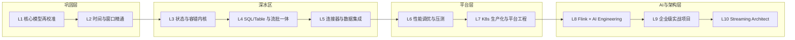

# 学习路线:从 Flink 开发者到 Enterprise Streaming Architect

> 适用对象:已有 Flink 生产项目经验、熟悉 Kafka / Spring 微服务 / K8s 基础 / LLM 应用开发的架构师。
> 十级体系,每级给出:学习目标 / 核心知识 / 实践项目 / 推荐阅读顺序 / 预计学习时间 / 掌握标准。
> 时间按"在职学习,每周 8~10 小时有效投入"估算。已有生产经验者建议做 Level 1–2 的掌握标准自测,通过即从 Level 3 进入。

## 总览

对应教材模块的映射关系见 [docs/README.md](../docs/README.md)(SSOT 索引)。

---

## Level 1 · 核心模型再校准(Flink 2.x 视角)

**学习目标**:把既有的 Flink 1.x 经验迁移到 Flink 2.x 心智模型;能准确画出一个作业从代码到物理执行的完整转换链路。

**核心知识**
- Flink 2.x 与 1.x 的断代差异:DataSet API 移除、Scala API 移除、配置体系迁移到 `config.yaml`、`CheckpointingMode` 等核心类包路径变更、Java 17/21 支持
- StreamGraph → JobGraph → ExecutionGraph → 物理执行图 的四层转换
- JobManager(Dispatcher / ResourceManager / JobMaster)与 TaskManager 职责边界
- Task / Subtask / Operator Chain / Slot / Slot Sharing Group
- 算子链的形成与断开条件(`disableChaining` / `startNewChain` / rebalance 边)

**实践项目**:`examples/e01-hello-flink` 三个作业跑通;在 Flink UI 中对照 JobGraph 手绘执行图,验证并行度 4 时的 subtask 分布与 slot 占用。

**推荐阅读顺序**:docs/01-runtime/01 → 02 → 03 章;Flink 2.0 Release Announcement(断代变更部分)。

**预计学习时间**:1 周。

**掌握标准**
- [ ] 不看资料画出 4 层图转换,并解释每层由谁(Client / JM)在何时生成
- [ ] 给定任意 DAG,能预判哪些算子会被 chain、需要多少 slot
- [ ] 能说清 Flink 2.x 相比 1.20 移除/变更的至少 6 项内容及迁移方案

---

## Level 2 · 时间语义与窗口精通

**学习目标**:对乱序数据、迟到数据、时钟漂移形成"肌肉记忆"级处理能力。

**核心知识**
- Event Time / Processing Time / Ingestion 语义与选型决策树
- Watermark 生成(周期式 / 打点式)、传播(多输入取小)、对齐(Watermark Alignment)与空闲源(idleness)
- Tumbling / Sliding / Session / Global Window + 自定义 WindowAssigner
- Trigger / Evictor / allowedLateness / sideOutputLateData 的组合语义
- 窗口状态的生命周期与清理时机(何时真正释放 state)

**实践项目**:`examples/e02-time-window`(Phase 1 交付,窗口 5 案例):乱序补偿、会话切分、迟到旁路、自定义连续触发 Trigger、多流 watermark 对齐实验。

**推荐阅读顺序**:docs/02-time-window 全模块 → 官方 "Timely Stream Processing" 概念篇复核。

**预计学习时间**:1.5 周。

**掌握标准**
- [ ] 给定一段乱序事件序列 + watermark 策略,手推每个窗口的触发时刻与迟到数据去向
- [ ] 能解释为什么某个窗口"迟迟不触发"的全部 5 类常见原因(源空闲、watermark 未对齐、并行度>分区数、时间语义配错、乱序上界过大)并逐一排查
- [ ] 生产事故演练:模拟一个分区静默导致全链路 watermark 停滞,并用 idleness + alignment 修复

---

## Level 3 · 状态与容错内核(深水区起点)

**学习目标**:把 State / Checkpoint / Savepoint 从"会用"提升到"能解释每一个字节的去向",具备 RocksDB 级调优能力。

**核心知识**
- Keyed State 五件套(Value/List/Map/Reducing/Aggregating)+ Operator State + Broadcast State
- State Backend:HashMap vs RocksDB(EmbeddedRocksDB)vs Flink 2.x 新增 **ForSt 存算分离后端** 的适用矩阵
- Checkpoint 全链路:Barrier 注入 → 对齐 / Unaligned Checkpoint → 异步快照 → 确认;增量 checkpoint 原理(SST 文件引用)
- Savepoint 与 Checkpoint 的本质区别、State Processor API 离线读写状态
- TTL、状态膨胀治理、changelog state backend、通用/精确一次语义(与两阶段提交 Sink 的关系)

**实践项目**:`examples/e03-state`(10 案例)+ `examples/e04-checkpoint`(4 案例):账户余额精确一次、Broadcast 规则动态下发、RocksDB 大状态 + 增量 checkpoint 压测、Savepoint 升级作业拓扑、State Processor API 修数。

**推荐阅读顺序**:docs/03-state → docs/04-checkpoint → RocksDB Wiki(memtable/SST/compaction 三篇)。

**预计学习时间**:3 周(本级是整条路线的分水岭,值得投入)。

**掌握标准**
- [ ] 能画出 barrier 对齐与非对齐两种模式下的完整时序图,并说明各自对反压的敏感性
- [ ] 给定 checkpoint 慢的现场指标,能在 sync/async 阶段、对齐耗时、上传耗时之间定位瓶颈
- [ ] 完成一次"改并行度 + 改 uid 拓扑"的 savepoint 恢复实战且状态零丢失

---

## Level 4 · SQL / Table API 与流批一体

**学习目标**:能用 SQL 承载 70% 的企业流处理需求,理解流上关系代数(changelog 语义)的每一处陷阱。

**核心知识**
- 动态表与 changelog(+I/-U/+U/-D)、回撤流 vs upsert 流
- 时间属性、窗口 TVF(TUMBLE/HOP/CUMULATE/SESSION)、Window Join / Interval Join / Temporal Join / Lookup Join / 常规双流 Join 的状态代价对比
- 去重、Top-N、CDC 摄入、Mini-batch / Local-Global / Delta Join 等优化开关
- Catalog 体系(内存 / JDBC / Hive / Paimon Catalog)
- Materialized Table(2.1+ 引入、2.2/2.3 持续增强)与流批一体调度
- Flink 2.x SQL AI 能力:`CREATE MODEL`、`ML_PREDICT`(2.1+)、`VECTOR_SEARCH`(2.2+)——与 Level 8 衔接

**实践项目**:`examples/e05-sql`(10 案例)+ `examples/e06-table-api`(8 案例);playground/ 中的 SQL Client 交互练习。

**推荐阅读顺序**:playground/README 热身 → docs/05-sql 全模块 → docs/06-table-api。

**预计学习时间**:2.5 周。

**掌握标准**
- [ ] 对任意 SQL 说出其状态构成与增长趋势,并给出 TTL / Join 改写方案
- [ ] 能解释一次 -U/+U 回撤在下游 Kafka(upsert-kafka)与 ClickHouse 中分别如何落地
- [ ] 用 EXPLAIN 读懂优化后的执行计划并定位一个真实的状态膨胀问题

---

## Level 5 · 连接器与数据集成(CDC / Lakehouse)

**学习目标**:掌握"进得来、出得去、对得上"的企业数据集成全景:Kafka 语义细节、CDC 整库同步、湖仓入湖。

**核心知识**
- Kafka connector 精确一次(事务、`transaction.timeout.ms` 与 checkpoint 间隔的约束关系)
- JDBC / Redis / ClickHouse / Elasticsearch / MinIO(S3)Sink 的语义等级与幂等设计
- Flink CDC 3.6:YAML Pipeline、整库同步、Schema Evolution、Transform、新 Oracle Source 与 Hudi Sink
- Lakehouse 三件套:Paimon(主推,流式湖仓)/ Iceberg / Hudi 的定位差异;Paimon 主键表、Changelog Producer、Compaction
- 自定义 Connector:新 Source API(Split/Enumerator/Reader)与 SinkV2(Committer/GlobalCommitter)

**实践项目**:`examples/e07-connectors`、`examples/e08-cdc`(PG→Paimon 整库同步)、`examples/e09-lakehouse`(MinIO 上的 Paimon 流读流写)。

**推荐阅读顺序**:docs/07-connectors → docs/08-cdc → docs/09-lakehouse。

**预计学习时间**:2.5 周。

**掌握标准**
- [ ] 完整解释 Kafka 端到端 exactly-once 的 2PC 时序,以及事务超时导致数据丢失的经典事故如何预防
- [ ] 独立完成 PostgreSQL → Paimon 的整库同步含 schema 变更演练
- [ ] 能为一个新的内部系统写出符合 Source API 规范的自定义 connector 骨架

---

## Level 6 · 性能调优与压测体系

**学习目标**:建立"先测量、后调优"的工程方法论;能面对反压、倾斜、GC、大状态四类问题给出系统化处方。

**核心知识**
- 内存模型:JVM Heap / Managed Memory / Network Buffer / Direct 的完整拆解与 `taskmanager.memory.*` 配置族
- 网络栈:Credit-based 流控、buffer debloating、反压的产生与观测(busy/backpressured 指标)
- 序列化:PojoSerializer vs Kryo vs 自定义 TypeInfo 的性能差与"意外 Kryo"排查
- 数据倾斜:两阶段聚合、local-global、rebalance/rescale 选型、KeyGroup 原理
- Benchmark 方法论:Nexmark 基准、指标口径(TPS / P99 Latency / checkpoint duration / GC)
- Flink 2.2 平衡调度(balanced task scheduling)、Adaptive Scheduler 与动态扩缩

**实践项目**:`benchmark/` 工程:对 e01/e05 作业做基线压测 → 注入倾斜 → 修复 → 回归对比,产出完整报告。

**预计学习时间**:2.5 周。

**掌握标准**
- [ ] 给一个反压作业,10 分钟内用 UI + 指标定位到反压根因算子并说明证据链
- [ ] 能把一个 checkpoint 超时的 RocksDB 大状态作业调到稳定(增量 + unaligned + 本地恢复)
- [ ] 产出一份可复现实验条件的 benchmark 报告(见 benchmark/README 模板)

---

## Level 7 · Kubernetes 生产化与平台工程

**学习目标**:从"会提交作业"到"能运营一个多租户 Flink 平台"。

**核心知识**
- 部署形态:Session / Application Mode(Per-Job 已移除)、Native K8s vs Operator
- Flink Kubernetes Operator 1.15:FlinkDeployment/FlinkSessionJob CRD、K8s 原生 Conditions、Blue/Green 发布(1.14+)、自动伸缩(Autoscaler)
- HA(K8s ConfigMap 高可用)、Savepoint 管理、升级策略(stateless/savepoint/last-state)
- 可观测:Prometheus 指标体系、日志(Loki)、Tracing(OpenTelemetry)
- CI/CD 与 GitOps:镜像流水线、Helm、ArgoCD、灰度与回滚
- 多租户:资源隔离、Fine-grained Resource Management、配额与成本

**实践项目**:`production/`:OrbStack 内置 K8s 上部署 Operator,完成一次 Blue/Green 升级 + 自动伸缩演练。

**预计学习时间**:3 周。

**掌握标准**
- [ ] 用 Operator 完成有状态作业的三种升级模式并解释状态保障差异
- [ ] 设计一套作业发布规范(uid 管理、savepoint 留存、回滚 SOP)并落成文档
- [ ] Grafana 上有一块能回答"平台今晚稳不稳"的总览看板

---

## Level 8 · Flink × AI Engineering(本仓库特色)

**学习目标**:掌握"事件驱动 AI"的完整工程学:让 Agent 从被动问答走向对实时事件的自主响应。

**核心知识**(详细展开见 [ai/README.md](../ai/README.md) 全书大纲)
- Flink SQL AI:`CREATE MODEL` / `ML_PREDICT` / `VECTOR_SEARCH` 的语义、异步推理、限流与降级
- **Flink Agents 0.3**:事件驱动 Agent 运行时、Action 级 exactly-once、三层记忆(Sensory/Short-Term/Long-Term+Mem0)、Agent Skills、YAML 声明式 API、Durable Execution 与 Reconciler
- Streaming RAG / Streaming Embedding / 向量库(Milvus)实时写入与检索
- Flink × LangGraph 的分工边界:何时用 Flink Agents、何时外呼 LangGraph 服务
- LLM 网关模式:Token 计量、模型路由、成本与守护(Guardrail)全部流式化
- MCP 在流式场景下的位置:工具调用的异步化与可靠性

**实践项目**:`ai/` 全部章节 Demo:日志异常的 Agent 自动分诊、流式向量化入 Milvus、ML_PREDICT 实时分类、Flink Agents + Ollama 本地闭环。

**预计学习时间**:4 周。

**掌握标准**
- [ ] 能论证"为什么这个 AI 场景应该/不应该放进 Flink"并给出架构对比
- [ ] 独立跑通 Flink Agents 0.3 的 Java Agent(含工具调用与长期记忆)并解释其 checkpoint 语义
- [ ] 设计一条含降级路径的流式 LLM 推理链路(超时、限流、旁路、成本核算)

---

## Level 9 · 企业级实战项目(可写进简历)

**学习目标**:以生产标准完成三个完整项目(见 PHASES.md Phase 4),覆盖架构评审 → 开发 → 压测 → 上线运维全流程。

**三个项目**
1. **AI Agent 实时日志分析平台**:Kafka → Flink(解析/异常检测)→ ClickHouse → LLM/LangGraph 根因分析 → Dashboard
2. **实时推荐系统**:Kafka → Flink 实时特征/画像 → Redis 特征库 → Embedding 召回 → Ranking API → Dashboard
3. **车联网实时监控平台**:10 万辆车 GPS/CAN/OTA/DTC 模拟 → Flink CEP 告警 → AI 预测性维护 → 数字孪生 Dashboard

**预计学习时间**:每个项目 3~4 周,共 10~12 周。

**掌握标准**:每个项目具备——完整架构文档与 ADR、可一键启动、压测报告、故障演练记录、简历级项目陈述(STAR 版本)。

---

## Level 10 · Enterprise Streaming Architect

**学习目标**:形成方法论输出能力:技术选型、平台治理、团队赋能、成本与合规。

**核心知识**
- 流处理选型全景:Flink vs Kafka Streams vs Spark Structured Streaming vs RisingWave/Materialize 的决策框架
- 平台治理:SLA 分级、多租户配额、混部与成本模型、容量规划
- 数据架构:Kappa/Lambda 的终局讨论、流式湖仓(Paimon/Fluss)对架构的重塑
- 组织与流程:流平台团队的接口设计(自助化、模板化、SLO 化)
- 前沿跟踪机制:FLIP 提案、Flink Forward 路线、社区月报的阅读方法

**实践项目**:为你所在企业(如车联网 OTA / 诊断平台)写一份《实时计算平台三年演进白皮书》,含现状评估、目标架构、迁移路线与成本测算。

**预计学习时间**:持续进行;集中输出约 3 周。

**掌握标准**
- [ ] 能主持一次跨团队的流处理选型评审并输出决策记录
- [ ] 白皮书通过至少两位资深同行评审
- [ ] 在 interview/ 题库的 L9-L10 段位达到"能反问面试官"的水平

---

## 总时间预算

| 阶段 | Level | 预计 |
|---|---|---|
| 巩固层 | L1–L2 | 2.5 周 |
| 深水区 | L3–L5 | 8 周 |
| 平台层 | L6–L7 | 5.5 周 |
| AI 与架构层 | L8–L10 | 17–19 周 |
| **合计** | | **约 8 个月**(在职节奏) |

已有生产经验者按自测结果跳级,常见路径为 L3 直入,总周期可压缩到 5~6 个月。
